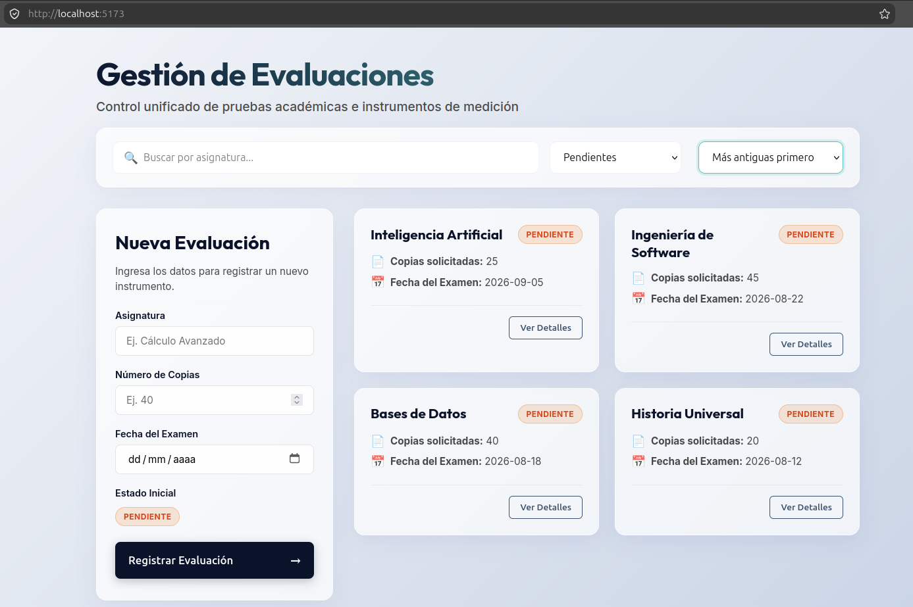

# Sistema de Gestión de Evaluaciones - Frontend

Este es el componente frontend del Sistema de Gestión de Evaluaciones, desarrollado con TypeScript y empaquetado mediante Vite. Este proyecto corresponde al Módulo 2 del curso Full Stack Java y se enfoca en presentar una interfaz dinámica, fuertemente tipada y de alto rendimiento.

## Interfaz de la Aplicación


<!-- Reemplaza "ruta/a/la/imagen.png" con la ruta real de tu captura de pantalla -->

## Arquitectura y Decisiones de Diseño

El desarrollo del frontend sigue estándares modernos de la web, garantizando escalabilidad y mantenibilidad del código:

- **Tipado Estricto (TypeScript):** Definición clara de modelos de datos mediante interfaces, evitando el uso de tipos dinámicos para prevenir errores en tiempo de desarrollo y ejecución.
- **Estructura Modular:** Separación de responsabilidades mediante la división de código en modelos, vistas (componentes) y lógica principal, facilitando la mantenibilidad.
- **Manipulación Segura del DOM:** Verificación rigurosa de referencias nulas y delegación eficiente de eventos para interacciones de usuario fluidas.
- **Asincronía Estructurada:** Uso del patrón `async/await` para el consumo de APIs externas (Fetch API), incluyendo el manejo de errores mediante bloques `try/catch`.
- **Estilos Nativos (Vanilla CSS):** Implementación de diseños responsivos y modernos utilizando Flexbox, CSS Grid y variables de entorno, evitando el acoplamiento a frameworks de terceros.

## Estructura del Proyecto

A continuación se detalla la organización de carpetas y archivos principales dentro del repositorio:

```text
gestion-evaluaciones-frontend/
├── index.html                 # Documento HTML principal y punto de entrada
├── package.json               # Configuración de dependencias y scripts de Node.js
├── tsconfig.json              # Configuración y reglas del compilador TypeScript
├── public/                    # Archivos estáticos y recursos sin procesar
└── src/                       # Código fuente de la aplicación
    ├── assets/                # Recursos multimedia e iconos
    ├── components/            # Componentes visuales y de interacción
    │   ├── EvaluationCard.ts  # Controlador y renderizado de la tarjeta de evaluación
    │   └── EvaluationCard.css # Estilos aislados del componente
    ├── models/                # Interfaces y definición de entidades del negocio
    │   └── Evaluation.ts      # Modelo principal de evaluación
    ├── styles/                # Estilos globales y específicos de maquetación
    │   └── page.css           # Reglas de estilo para contenedores de página
    ├── main.ts                # Lógica central e inicialización de la aplicación
    └── style.css              # Declaraciones CSS base (variables y resets)
```

> [!NOTE]
> **Datos Simulados (Mock Data):** De manera temporal, la carpeta `public/` contiene archivos JSON que simulan las respuestas del servidor. Esto permite emular la conexión asíncrona a la base de datos y probar el consumo de APIs mediante `fetch` de manera independiente, mientras se finaliza la integración con el backend definitivo.

## Requisitos Previos

Para ejecutar y construir el proyecto, es necesario contar con las siguientes herramientas instaladas:

- **Node.js** (Versión LTS recomendada, ej. v18 o v20)
- **NPM** (Incluido con la instalación de Node.js)

## Comandos Disponibles

Antes de iniciar cualquier comando, asegúrese de instalar las dependencias locales del proyecto:

```bash
npm install
```

### Ejecución en Entorno de Desarrollo

Para levantar el entorno de desarrollo local con recarga rápida (HMR) proporcionado por Vite:

```bash
npm run dev
```

El servidor quedará expuesto por defecto y brindará una URL en la terminal (ej. `http://localhost:5173`) para visualizar los cambios en tiempo real.

### Construcción para Producción

Para compilar el código fuente de TypeScript y empaquetar la aplicación de forma óptima para su despliegue en producción:

```bash
npm run build
```

El resultado compilado y minificado será generado dentro de la carpeta `dist/`.

### Previsualizar el Entorno de Producción

Para correr un servidor local que sirva los archivos compilados en la carpeta `dist/`, con el fin de verificar el comportamiento final previo al despliegue:

```bash
npm run preview
```
